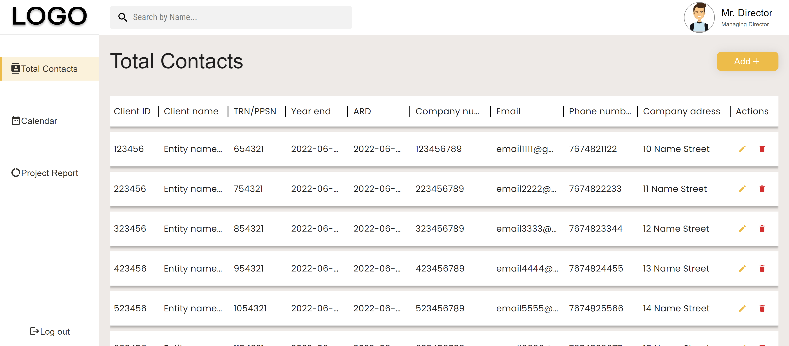

# 📝 Приложение редактирования документов
[Cсылка на демо](https://eduardvorsin.github.io/vdcom-test-app/)




## Технологии которые использовались при написании


## 📄 Описание проекта
Данное приложение представляет из себя таблицу с контактами, поля которой можно редактировать, удалять, и добавлять новые поля

Для работы с приложением сначала нужно авторизоваться через имя пользователя(root1) и пароль(root1). 

## 🛠️Как запустить проект
1. Клонировать это репозиторий с помощью команды:

`git clone https://github.com/eduardvorsin/vdcom-test-app.git`

2. Установить нужные зависимости используя следующую команду
```
$ npm i
```
3. Запустить приложение

Для запуска в режиме разработки
```
$ npm start
```
Для сборки build версии проекта
```
$ npm run build
```

## ✨ Особенности
- Возможность авторизации и выхода из аккаунта
- Поддержка CRUD операций для работы с таблицей
- Имеется валидация форм
 
